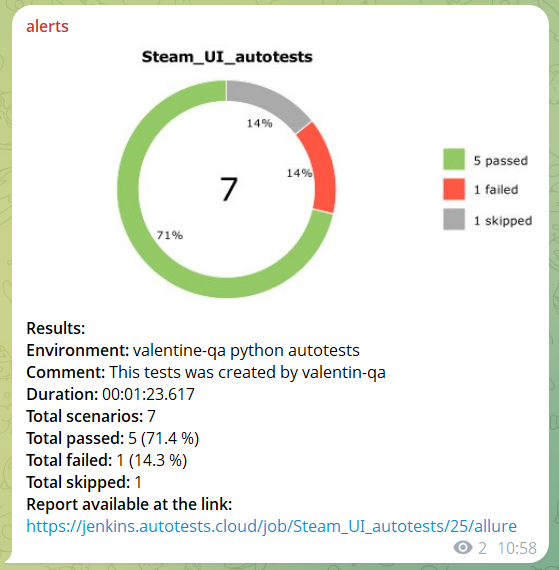

# <a target="_blank" href="https://store.steampowered.com/">Steam</a> UI Autotesting Pet Project by valentine-qa

---
### Check list of autotests
1. Search game by title.
2. Moving to login page.
3. Adding a game to the cart.
4. Removing a game from the cart.
5. Clearing cart.

---

### Used Tools

---

### Run autotests with Jenkins
> [Link on task in Jenkins](https://jenkins.autotests.cloud/job/Steam_UI_autotests/)

#### To run autotests in Jenkins
1. Open [task in Jenkins](https://jenkins.autotests.cloud/job/Steam_UI_autotests/)  
   (Username/password for authorization in Jenkins: valentine_guest/valentine_guest)

2. Click "**Build Now**".

---

### Allure report

#### Overall result

#### Test results with screenshots, html files, logs and videos

#### Graphics

---

### Integration Jenkins with Allure TestOps
(Login/password: allure8/allure8)
> [Dashboard with general results](https://allure.autotests.cloud/project/4223/dashboards)

> [Test-cases](https://allure.autotests.cloud/project/4816/test-cases/38739?treeId=0)

---

### Integration Jenkins with Jira
> [Tasks in Jira](https://jira.autotests.cloud/browse/HOMEWORK-1473)  
(Login/password: jira8/jira8) 

---

### Telegram Alerts

---

### Autotest video

